# Spartan6 - DSP48A1 — Digital Design Project

> **By:** Mazen Mohamed Hemdan

This project presents a **fully custom DSP48A1-based pipeline design** targeting the **Xilinx Spartan-6** FPGA family. It includes RTL development, simulation, linting, constraint specification, elaboration, synthesis, implementation, and bitstream generation.

---

## Full Design Reference

- This design is based on the **DSP48A1 documentation and usage guidelines** from AMD:
  [UG389 - Spartan-6 DSP48A1 Slice](https://docs.amd.com/v/u/en-US/ug389)

### Full Design Block
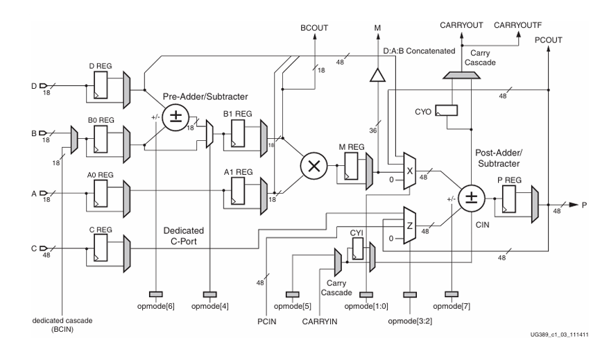

---

## Objective

Design and verify a DSP-like pipeline architecture using **Verilog HDL** and AMD/Xilinx’s **DSP48A1** primitive, covering:
- 4 DSP paths
- Configurable pipeline stages
- Functional and timing verification
- Schematic exploration and wave analysis

---

## Tools & Technologies

- **Verilog HDL** — RTL Design  
- **QuestaSim** — Simulation  
- **QuestaLint** — Linting and static analysis  
- **Vivado Design Suite** — Elaboration, Synthesis, Implementation, Bitstream Generation  
- **Target FPGA:** Xilinx Spartan-6 (using DSP48A1 primitive)

---

## Project Structure

```
├── Constrain_File/     # .xdc / .ucf file for timing and pin constraints
├── Do_File/            # QuestaSim DO scripts for batch simulation
├── Images/             # Design images, waveforms, schematics, timing reports
├── RTL_Verilog/        # Source Verilog HDL files
├── Testbench_Code/     # Testbench and simulation code
├── Document.pdf        # Full project report (design + verification + results)
```

---

## Design Highlights

- Modular RTL architecture supporting 4 configurable DSP paths
- FSMs, muxes, arithmetic units, and pipelining
- 100 MHz clock constraint applied via UCF
- Formal/functional simulation of all DSP paths

---

## Verification: Waveforms per DSP Path

### Path 1
<div style="display: flex; gap: 10px;">
  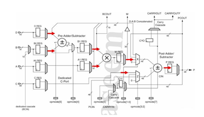
  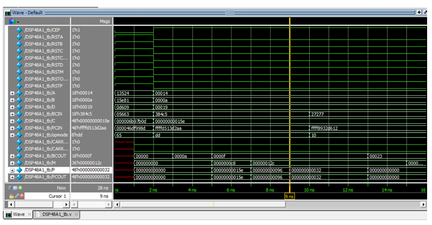
</div>

### Path 2
<div style="display: flex; gap: 10px;">
  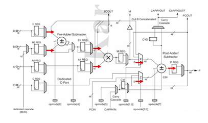
  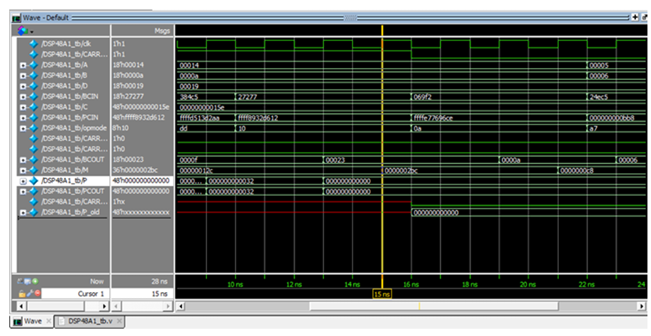
</div>

### Path 3
<div style="display: flex; gap: 10px;">
  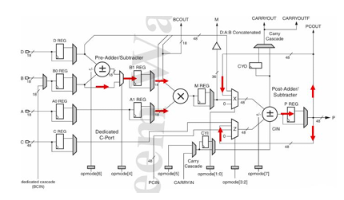
  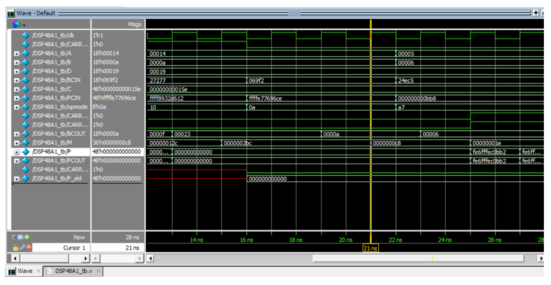
</div>

### Path 4
<div style="display: flex; gap: 10px;">
  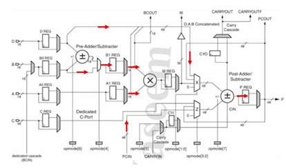
  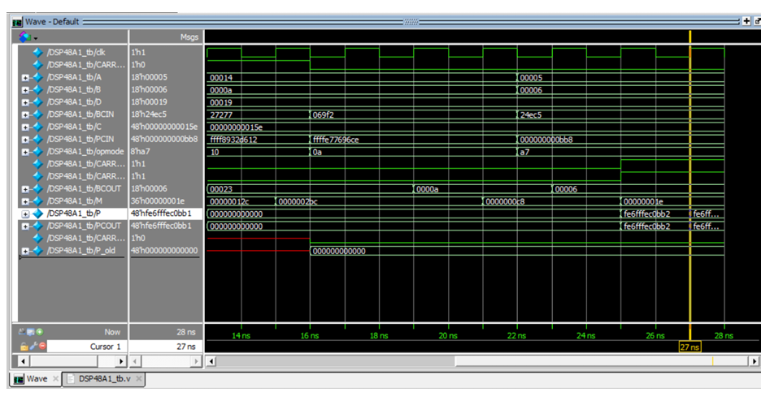
</div>

---

## Elaboration, Synthesis & Implementation (Vivado)

- ✅ Linting Passed — *0 Warnings, 0 Errors*
- ✅ Synthesis & Implementation — Successful
- 🎯 **Bitstream Generation** — Completed
- 📐 Includes both:
  - RTL schematic  
  - Post-synthesis schematic  

### RTL vs Synthesis Schematics
<div style="display: flex; gap: 10px;">
  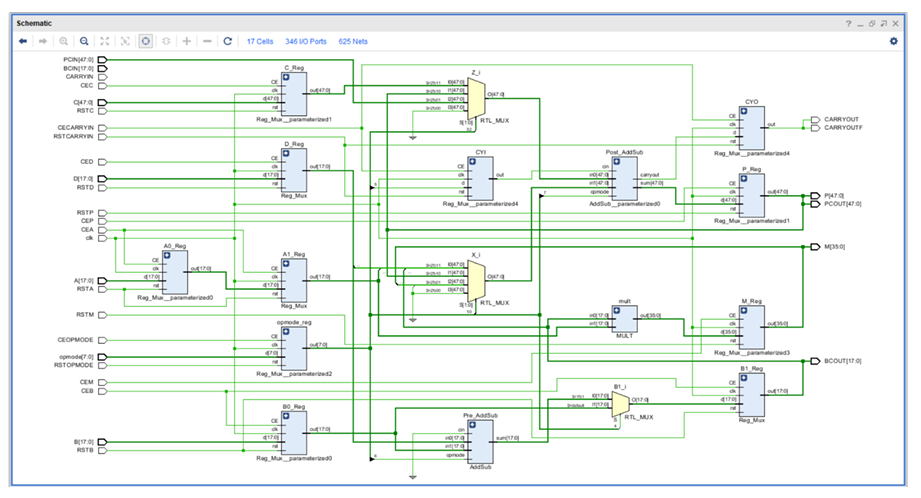
  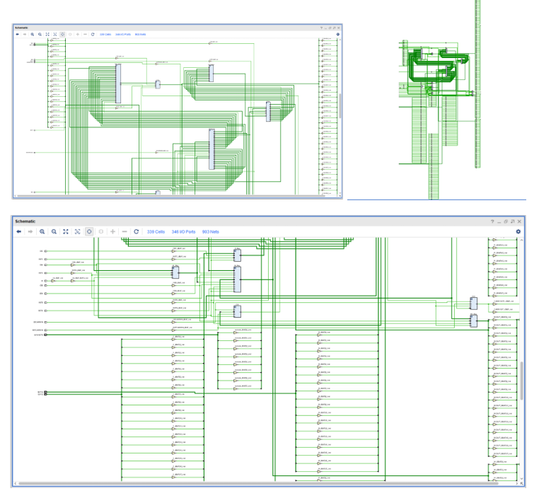
</div>

---

## ⏱ Timing Analysis (Vivado)

Achieved the following timing closure results:

- **Worst Negative Slack (Setup):** `+5.168 ns`  
- **Worst Negative Slack (Hold):** `+0.182 ns`  

### Timing Report Snapshot
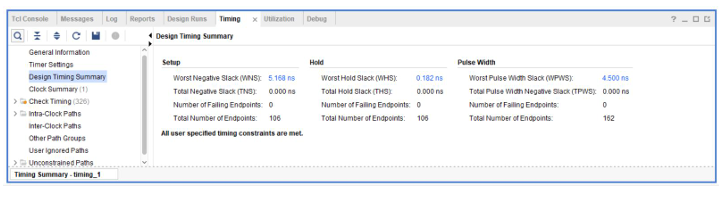

---

## Documentation

A detailed project report (`Document.pdf`) is included in the repository with:
- RTL design breakdown
- Testbench development
- Verification results
- DO files and constraint settings
- All Vivado reports

---

## Author

**Mazen Mohamed Hemdan**  
Bachelor of Computer Engineering  
Focus: Digital Design, Computer Architecture, Hardware Verification


